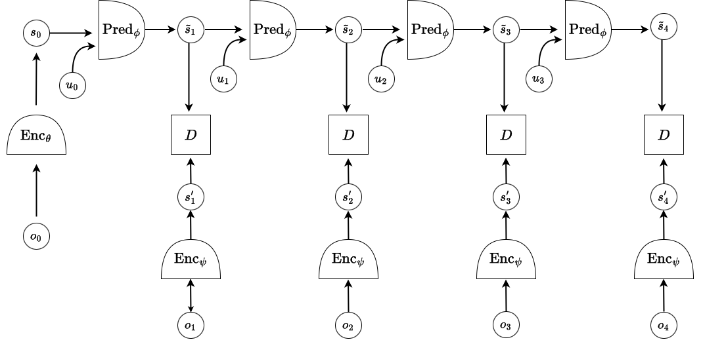
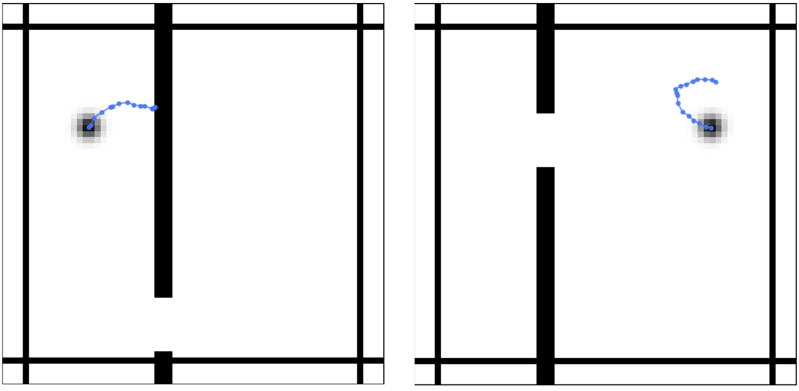

# JEPA World Model for Two-Room Navigation

A PyTorch implementation of a **Joint Embedding Predictive Architecture (JEPA)** world model trained on 2.5M frames of agent trajectories in a two-room environment. This project explores self-supervised representation learning for spatial reasoning and multi-step prediction, without any image reconstruction objective. Ranked **top 5 of ~30 teams** in a competitive evaluation and presented to **Prof. Yann LeCun**.

---

## Overview

The goal of this project is to train a world model that learns meaningful representations of agent state and environment layout purely from observation-action sequences — no labels, no reconstruction. The learned representations are evaluated by how well a lightweight linear probe can recover the agent's true $(x, y)$ coordinates from predicted future states.

This is a practical implementation of the JEPA framework first proposed by [LeCun (2022)](https://openreview.net/pdf?id=BZ5a1r-kVsf), adapted to a 2D navigation setting with structured environment layouts.

---

## Architecture

The model consists of three learned components:

**Encoder** — Dual-channel CNN that separately encodes the agent channel and the wall/border channel, then fuses them into a joint state embedding:

$$
s_0 = \text{Enc}_\theta(o_0)
$$

**Predictor** — Autoregressive MLP that rolls out future state representations conditioned on actions:

$$
\tilde{s}_n = \text{Pred}_\phi(\tilde{s}_{n-1}, u_{n-1})
$$

**Target Encoder** — A copy of the encoder used to produce training targets (identical weights, no momentum update):

$$
s'_n = \text{Enc}_\psi(o_n)
$$

The training objective minimizes the distance between predicted and target representations across the rollout:

$$
F(\tau) = \sum_{n=1}^{N} D(\tilde{s}_n, s'_n)
$$



---

## Collapse Prevention: VICReg

Naively minimizing the prediction distance causes representational collapse. We prevent this using **VICReg** — a regularization scheme that enforces three properties on the learned embeddings:

- **Invariance**: predictions should match targets (MSE loss)
- **Variance**: each embedding dimension should maintain non-trivial variance across the batch
- **Covariance**: embedding dimensions should be decorrelated

The total loss is:

$$
\mathcal{L} = \lambda_{\text{inv}} \cdot \mathcal{L}_{\text{MSE}} + \lambda_{\text{var}} \cdot \mathcal{L}_{\text{std}} + \lambda_{\text{cov}} \cdot \mathcal{L}_{\text{cov}}
$$

with coefficients $\lambda_{\text{inv}} = 25$, $\lambda_{\text{var}} = 25$, $\lambda_{\text{cov}} = 1$.

---

## Environment

The environment consists of an agent (dot) navigating two rooms separated by a wall with a door. The agent cannot pass through walls except through the door. Wall and door positions vary across trajectories, requiring the model to perceive and adapt to different layouts.



**Data format:**
- States: `(num_trajectories, trajectory_length, 2, 64, 64)` — two-channel images (agent channel + wall channel)
- Actions: `(num_trajectories, trajectory_length-1, 2)` — $(Δx, Δy)$ displacement vectors

Training data: 2.5M frames loaded via memory-mapped NumPy for efficiency.

---

## Evaluation: Representation Probing

Representation quality is measured by training a frozen 2-layer FC **prober** on top of predicted embeddings $\tilde{s}_1, \ldots, \tilde{s}_N$ to recover ground-truth agent coordinates $(y_1, y_2)$:

$$
F(x, y) = \sum_{n=1}^{N} \lVert y_n - \text{Prober}(\tilde{s}_n) \rVert_2^2
$$

Lower MSE means richer, more spatially informative representations.

**Results:**

| Evaluation Set | MSE |
|---|---|
| Normal trajectories | 1.89 |
| Wall-collision trajectories | 6.18 |
| Wall (other) | 7.16 |
| Expert trajectories | 7.18 |

---

## Setup & Usage

### Installation

```bash
git clone https://github.com/goel-deepesh/Advanced-Topic-Modeling-and-Clustering
cd <repo>
pip install -r requirements.txt
```

### Training

```bash
python train.py
```

Checkpoints are saved per epoch to `model_checkpoints/`. Training runs for 60 epochs with Adam optimizer and cosine LR scheduling.

### Evaluation

```bash
python main.py
```

Loads `jepa_model_epoch_final.pth`, trains the prober on 170k frames, and reports MSE on all validation sets.

---

## Model

| Component | Details |
|---|---|
| Wall encoder | 2-layer CNN → Linear |
| Agent encoder | 2-layer CNN → Linear, applied across timesteps |
| State predictor | Action embedding + MLP |
| Representation dim | 128 |
| Trainable parameters | 4,945,712 |

---

## References

- LeCun, Y. (2022). [A Path Towards Autonomous Machine Intelligence](https://openreview.net/pdf?id=BZ5a1r-kVsf)
- Bardes et al. (2022). [VICReg: Variance-Invariance-Covariance Regularization](https://arxiv.org/pdf/2105.04906)
- Grill et al. (2020). [BYOL: Bootstrap Your Own Latent](https://arxiv.org/pdf/2006.07733)
- Zbontar et al. (2021). [Barlow Twins](https://arxiv.org/pdf/2103.03230)
